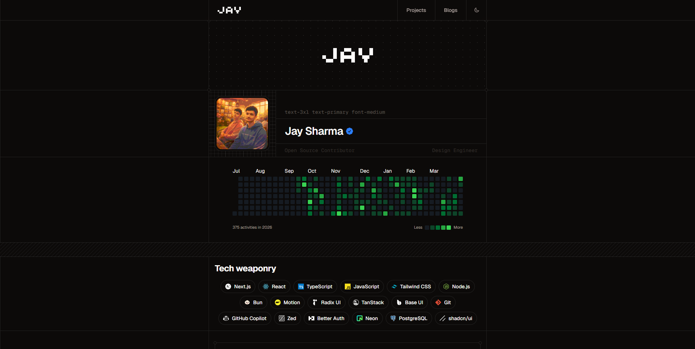
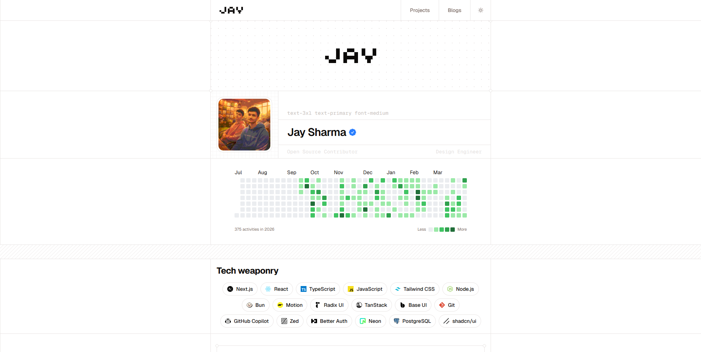

# Personal Developer Portfolio

<p align="center">
  
  <br />
  <br />
  
</p>

A modern, highly interactive, and minimalist personal developer portfolio built with **TanStack Start**, **React 19**, and **Tailwind CSS v4**. 

This portfolio features a sleek dark/light mode, fluid Framer Motion animations, custom sound effects, a live GitHub contribution graph, and an ultra-polished UI crafted with customized Shadcn and Base UI components.

## Features

- **TanStack Start Architecture**: Full-stack React framework utilizing TanStack Router for seamless SSR and client-side routing.
- **Minimalist & Polished UI**: Designed with an eye for detail. Features squircle icons, custom dashed grids
, rotated corner decorations, and pattern separators.
- **Theme Toggle**: Flawless dark and light mode switching with a native, animated toggle button using `mix-blend-difference` effects.
- **Interactive Sound Effects**: Built-in Web Audio API sound engine (`useSound` hook) providing satisfying auditory
 feedback (8-bit clicks, book opening sounds) when interacting with accordions and toggles.
- **Live GitHub Graph**: Fetches and renders your GitHub contribution history in a scroll-friendly, GitHub-styled calendar using Kibo UI components.
- **Animated Navbar**: Sticky navigation with smooth scrolling, featuring a buttery-smooth "slide-down" hover animation powered by native CSS and mix-blend modes.
- **Accordion Projects List**: A clean, compact accordion-style project showcase categorized by "Own", "Redesigns", and "Open Source", complete with dynamic technology icon badges.
- **Fully Responsive**: Carefully optimized for mobile and desktop viewing, with custom hidden scrollbars and touch-friendly targets.

## Tech Stack

- **Framework**: [TanStack Start](https://tanstack.com/start) & [Vite](https://vitejs.dev/)
- **Frontend Library**: [React 19](https://react.dev/)
- **Styling**: [Tailwind CSS v4](https://tailwindcss.com/)
- **Animations**: [Framer Motion](https://framer.com/motion) & Native CSS
- **UI Components**: [Shadcn UI](https://ui.shadcn.com/) & [Base UI](https://base-ui.com/)
- **Icons**: [Phosphor Icons](https://phosphoricons.com/) & Custom SVGs
- **Typography**: Geist & Geist Mono
- **Deployment & Server**: Nitro

## Project Structure

```text
portfolio/
├── public/                 # Static assets, local tech-stack SVGs, and social icons
├── src/
│   ├── components/
│   │   ├── animations/     # Framer Motion wrapper components
│   │   ├── kibo-ui/        # GitHub contribution graph components
│   │   ├── some-core/      # Core portfolio sections (About, Projects, Navbar, etc.)
│   │   └── ui/             # Reusable UI primitives (Accordion, Button, Separator)
│   ├── hooks/              # Custom React hooks (e.g., use-sound)
│   ├── lib/                # Utilities, audio assets, and sound-engine logic
│   └── routes/             # TanStack Router file-based routing (__root.tsx, index.tsx)
├── vite.config.ts          # Vite configuration including Nitro plugin
├── tailwind.config.js      # Tailwind v4 config (integrated via Vite)
└── package.json            # Project dependencies and scripts
```

## Getting Started

### Prerequisites

Make sure you have [Node.js](https://nodejs.org/) (v18+) and [Bun](https://bun.sh/) (or npm/pnpm/yarn) installed.

### Installation

1. Clone the repository:
   ```bash
   git clone https://github.com/yourusername/portfolio.git
   cd portfolio
   ```

2. Install dependencies:
   ```bash
   bun install
   # or npm install
   ```

3. Start the development server:
   ```bash
   bun run dev
   # or npm run dev
   ```
   The site will be available at `http://localhost:3000`.

## Building & Deployment

This project uses **Nitro** as its server engine, making it universally deployable to platforms like Vercel, Netlify, Cloudflare, or custom Node servers.

To build the project for production:

```bash
bun run build
# or npm run build
```

To test the production build locally:

```bash
bun run start
# or npm run start
```
*(This executes `node .output/server/index.mjs`)*

### Deploying to Vercel

1. Push your code to your GitHub repository.
2. Import the project into Vercel.
3. Vercel will automatically detect the build output from the Nitro engine. No custom `vercel.json` rewrites are required for TanStack Start SSR to function correctly.

## Customization

- **Profile & About**: Update your personal details in `src/components/some-core/about.tsx` and `about-info.tsx`.
- **Projects**: Modify the `PROJECTS` array in `src/components/some-core/projects.tsx`. To add new technology icons, drop them into `public/tech-stack/` and map them in the `TECH_ICONS` record.
- **Social Links**: Replace the links and icons in the `AboutInfo` component. The project relies on assets in `public/icons/`.

## License

This project is open-source and available under the [MIT License](LICENSE).